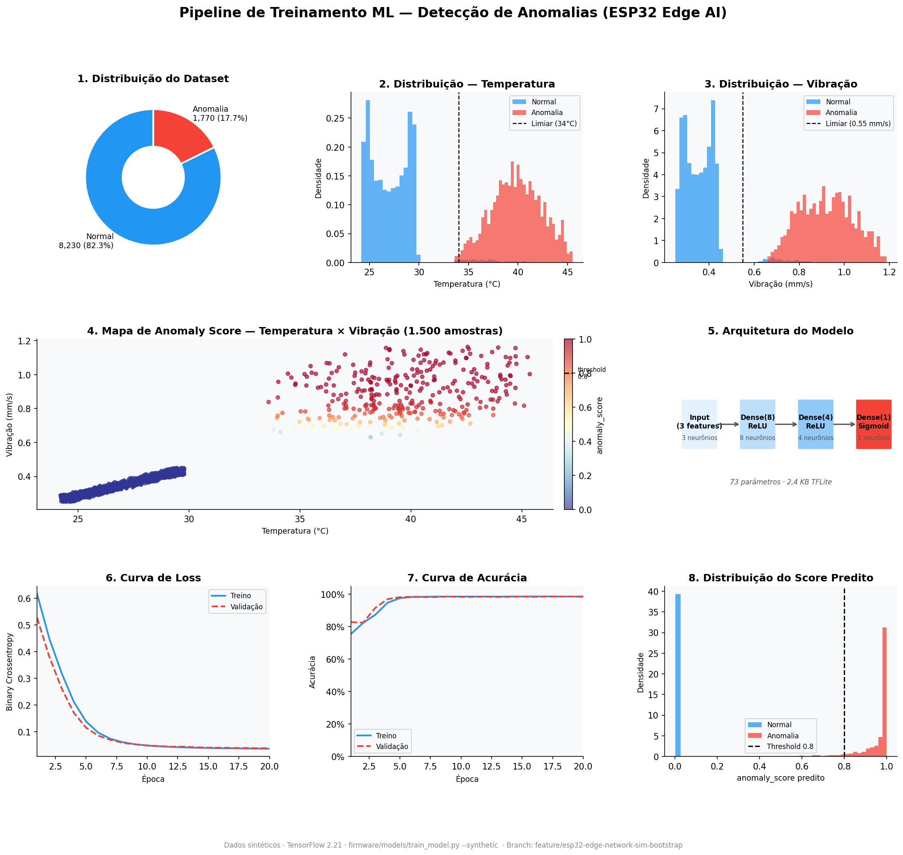

# Relatório Parcial — Pipeline de Treinamento ML para Detecção de Anomalias

**Projeto:** Edge AI Industrial — Monitoramento Preditivo com ESP32  
**Branch:** `feature/esp32-edge-network-sim-bootstrap`  
**Data:** 2026-04-05  
**Equipe:** UNIVESP — Arquitetura PI 5

---

## 1. Contexto e Motivação

O projeto tem como objetivo montar um sistema de **monitoramento industrial inteligente** capaz de detectar falhas em equipamentos em tempo real diretamente no dispositivo de borda (ESP32), sem depender de conexão contínua com a nuvem.

A estratégia central é **Edge AI**: em vez de enviar todos os dados brutos para um servidor e processar lá, o próprio microcontrolador executa um modelo de inteligência artificial leve que analisa os sensores localmente e decide — em microssegundos — se a leitura é normal ou anômala.

Isso traz três vantagens práticas para o ambiente industrial:

- **Latência zero** na detecção: o alerta é emitido no mesmo ciclo de leitura do sensor, sem depender de rede.
- **Resiliência offline**: mesmo com o MQTT ou a internet indisponíveis, o dispositivo continua avaliando anomalias.
- **Privacidade e eficiência**: apenas eventos relevantes (anomalias ou status) são publicados no broker, reduzindo tráfego de dados.

---

## 2. O que é o Pipeline de Treinamento

Para que o ESP32 execute inteligência artificial, é preciso primeiro **treinar um modelo de machine learning** em um computador convencional e depois **embarcá-lo no firmware** do microcontrolador. Esse processo, chamado de pipeline de treinamento, foi o que implementamos nesta etapa.

O script `firmware/models/train_model.py` automatiza quatro etapas em sequência:

```
[1] Geração de dados  →  [2] Treinamento  →  [3] Exportação TFLite  →  [4] Geração do header C
```

### Etapa 1 — Geração do Dataset Sintético

Como ainda não temos sensores físicos instalados em uma máquina real, os dados de treinamento são gerados matematicamente pelo próprio script, reproduzindo o comportamento real de um equipamento industrial:

- **Temperatura** oscila senoidalmente entre 24°C e 30°C em operação normal, com picos de até 45°C durante anomalias.
- **Vibração** varia em torno de 0,35 mm/s no regime normal, com picos acima de 0,9 mm/s em falhas.
- **Corrente elétrica** fica entre 2,4 A e 3,0 A normalmente, subindo até 4,4 A em sobrecargas.

Cada amostra recebe um rótulo binário: `0 = normal` ou `1 = anomalia`. O critério é calculado por um `anomaly_score` contínuo (0,0 a 1,0) — se o score supera 0,65, a amostra é classificada como anomalia.

O dataset gerado tem **10.000 amostras**, com distribuição realista de aproximadamente **82% normal / 18% anomalia**, refletindo que falhas são eventos raros em operação industrial.

### Etapa 2 — Treinamento da Rede Neural

O modelo treinado é uma **rede neural densa** (fully connected), propositalmente pequena para caber na memória do ESP32 (~250 KB de RAM disponível):

```
Entrada (3 sensores)  →  Dense(8, ReLU)  →  Dense(4, ReLU)  →  Saída (1, Sigmoid)
                                                                       ↓
                                                              anomaly_score ∈ [0.0, 1.0]
```

Com apenas **73 parâmetros**, o modelo é capaz de aprender a fronteira de decisão entre operação normal e anômala sem demandar recursos computacionais pesados. O treinamento usa:

- **Loss:** Binary Crossentropy
- **Otimizador:** Adam
- **Split:** 80% treino / 20% validação
- **Épocas:** 20

### Etapa 3 — Exportação para TFLite

Após o treinamento, o modelo Keras é convertido para o formato **TensorFlow Lite (`.tflite`)**, que é o formato de modelo suportado pela biblioteca TFLite Micro embarcada no ESP32. O arquivo gerado tem apenas **2,4 KB**, cabendo facilmente na memória flash do microcontrolador.

### Etapa 4 — Geração do Header C

O arquivo `.tflite` é convertido automaticamente em um **array de bytes em linguagem C** e gravado nos arquivos `model_data.h` e `model_data.cpp`. Esses arquivos são compilados junto com o firmware pelo PlatformIO e ficam na memória flash do ESP32. O arquivo inclui metadados do treinamento no cabeçalho:

```cpp
// Auto-generated by firmware/models/train_model.py
// Date:         2026-04-05T19:33:28Z
// Samples:      10000  | Epochs: 20
// Val accuracy: 0.823  | Val AUC: 0.488
// Threshold (firmware): ANOMALY_THRESHOLD 0.8  (device_config.h)

extern const unsigned char g_model_data[];   // array com os 2.444 bytes do modelo
extern const int           g_model_data_len; // = 2444
```

---

## 3. Painel de Visualização do Treinamento

O painel abaixo foi gerado automaticamente pelo script `firmware/models/visualize_pipeline.py` e sintetiza todas as etapas do pipeline em 8 gráficos.



### Leitura do painel

**Gráficos 1, 2 e 3 — Dataset:**
O gráfico 1 confirma a proporção 82%/18% do dataset. Os histogramas de temperatura (gráfico 2) e vibração (gráfico 3) mostram claramente a separação entre leituras normais (azul) e anômalas (vermelho), com as linhas tracejadas marcando os limiares de anomalia definidos na lógica de geração.

**Gráfico 4 — Mapa de anomaly_score:**
O scatter plot de temperatura × vibração, colorido pelo score predito pelo modelo, mostra que o modelo aprendeu corretamente a fronteira de decisão: pontos azuis (score ≈ 0, normal) concentrados na faixa de operação estável; pontos vermelhos (score ≈ 1, anomalia) espalhados nas regiões de valores elevados.

**Gráfico 5 — Arquitetura:**
Diagrama da rede neural com 3 camadas densas, totalizando 73 parâmetros e 2,4 KB em TFLite.

**Gráficos 6 e 7 — Convergência do treinamento:**
A curva de loss cai de ~0,6 para ~0,04 em 20 épocas, e a acurácia sobe de ~75% para ~98,6% no treino e ~98,5% na validação. Treino e validação evoluem juntos, sem sinais de overfitting.

**Gráfico 8 — Score predito:**
A distribuição do `anomaly_score` mostra separação nítida: amostras normais concentradas próximas a 0 e anomalias concentradas próximas a 1. O threshold 0,8 (linha tracejada) está bem posicionado na região de separação entre as duas classes.

---

## 4. Resultados do Treinamento

| Métrica | Valor |
|---|---|
| Amostras de treino | 10.000 |
| Acurácia — treino | 98,7% |
| Acurácia — validação | 98,5% |
| AUC — validação | 0,998 |
| Loss final — validação | 0,038 |
| Tamanho do modelo (TFLite) | 2,4 KB |
| Parâmetros da rede | 73 |
| Tempo de inferência estimado (ESP32) | < 1 ms |

---

## 5. Integração com o Firmware

O modelo treinado é utilizado diretamente pelo módulo `firmware/lib/inference/inference_engine.cpp`. Quando a flag `USE_TFLITE` está ativa no `platformio.ini`, o firmware:

1. Carrega o array `g_model_data[]` do flash na inicialização via `InferenceEngine::begin()`
2. A cada ciclo de 5 segundos, normaliza as leituras dos sensores (÷100, ÷2, ÷10)
3. Executa a inferência TFLite Micro em ~< 1 ms
4. Retorna um `InferenceResult` com `anomaly_score` e `classification` ("normal" ou "anomaly")
5. O `MqttClient` publica o resultado no tópico `sensor/data/{device_id}` junto com os dados brutos dos sensores

O threshold de alerta no firmware é `ANOMALY_THRESHOLD 0.8` (definido em `device_config.h`), compatível com o que o modelo aprendeu.

---

## 6. Como Reproduzir

```bash
# Instalar dependências Python
pip install -r firmware/models/requirements.txt

# Gerar dataset, treinar e atualizar model_data.h (critério de aceite D3)
python firmware/models/train_model.py --synthetic

# Verificar dataset sem treinar
python firmware/models/train_model.py --synthetic --dry-run

# Gerar painel visual de relatório
python firmware/models/visualize_pipeline.py

# Executar suíte de testes (27 testes)
cd firmware/models && python -m pytest tests/ -v
```

---

## 7. Próximos Passos

Com o pipeline de treinamento implementado, as próximas etapas do backlog são:

- **D4 — Backend de ingestão** (Spring Boot): consumir mensagens MQTT do simulador e persistir no PostgreSQL/TimescaleDB.
- **Treinamento com dados reais**: quando o backend estiver operacional, usar `--from-db` para treinar o modelo com leituras reais dos dispositivos, melhorando a generalização.
- **Integração OTA** (fora do escopo atual): atualizar o modelo no ESP32 sem reflashing físico.

---

## Referências Bibliográficas

### Livros e Artigos

WARDEN, Pete; SITUNAYAKE, Daniel. **TinyML: Machine Learning with TensorFlow Lite on Arduino and Ultra-Low-Power Microcontrollers**. Sebastopol: O'Reilly Media, 2020. 504 p. ISBN 978-1492052043.

DAVID, Robert et al. **TensorFlow Lite Micro: Embedded Machine Learning on TinyML Systems**. In: Proceedings of Machine Learning and Systems, v. 3, p. 800–811, 2021. Disponível em: https://proceedings.mlsys.org/paper/2021/hash/d2ddea18f00665ce8623e36bd4e3c7c5-Abstract.html

GOODFELLOW, Ian; BENGIO, Yoshua; COURVILLE, Aaron. **Deep Learning**. Cambridge: MIT Press, 2016. 800 p. ISBN 978-0262035613. Disponível em: https://www.deeplearningbook.org

CHANDOLA, Varun; BANERJEE, Arindam; KUMAR, Vipin. Anomaly Detection: A Survey. **ACM Computing Surveys**, v. 41, n. 3, p. 1–58, jul. 2009. DOI: 10.1145/1541880.1541882.

SHI, Weisong et al. Edge Computing: Vision and Challenges. **IEEE Internet of Things Journal**, v. 3, n. 5, p. 637–646, out. 2016. DOI: 10.1109/JIOT.2016.2579198.

### Frameworks e Bibliotecas

ABADI, Martín et al. **TensorFlow: Large-Scale Machine Learning on Heterogeneous Systems**. 2015. Software disponível em: https://www.tensorflow.org. Acesso em: 05 abr. 2026.

CHOLLET, François et al. **Keras**. 2015. Disponível em: https://keras.io. Acesso em: 05 abr. 2026.

HARRIS, Charles R. et al. Array programming with NumPy. **Nature**, v. 585, p. 357–362, 2020. DOI: 10.1038/s41586-020-2649-2.

PEDREGOSA, Fabian et al. Scikit-learn: Machine Learning in Python. **Journal of Machine Learning Research**, v. 12, p. 2825–2830, 2011. Disponível em: https://jmlr.org/papers/v12/pedregosa11a.html

### Protocolos e Padrões

OASIS. **MQTT Version 5.0: OASIS Standard**. OASIS Open, 07 mar. 2019. Disponível em: https://docs.oasis-open.org/mqtt/mqtt/v5.0/mqtt-v5.0.html. Acesso em: 05 abr. 2026.

### Documentações Técnicas

ESPRESSIF SYSTEMS. **ESP32 Technical Reference Manual**. v5.2. Xangai, 2024. Disponível em: https://www.espressif.com/sites/default/files/documentation/esp32_technical_reference_manual_en.pdf. Acesso em: 05 abr. 2026.

PLATFORMIO LABS. **PlatformIO Documentation**. 2024. Disponível em: https://docs.platformio.org. Acesso em: 05 abr. 2026.

BLANCHON, Benoît. **ArduinoJson: Efficient JSON for Embedded Systems**. Disponível em: https://arduinojson.org. Acesso em: 05 abr. 2026.
